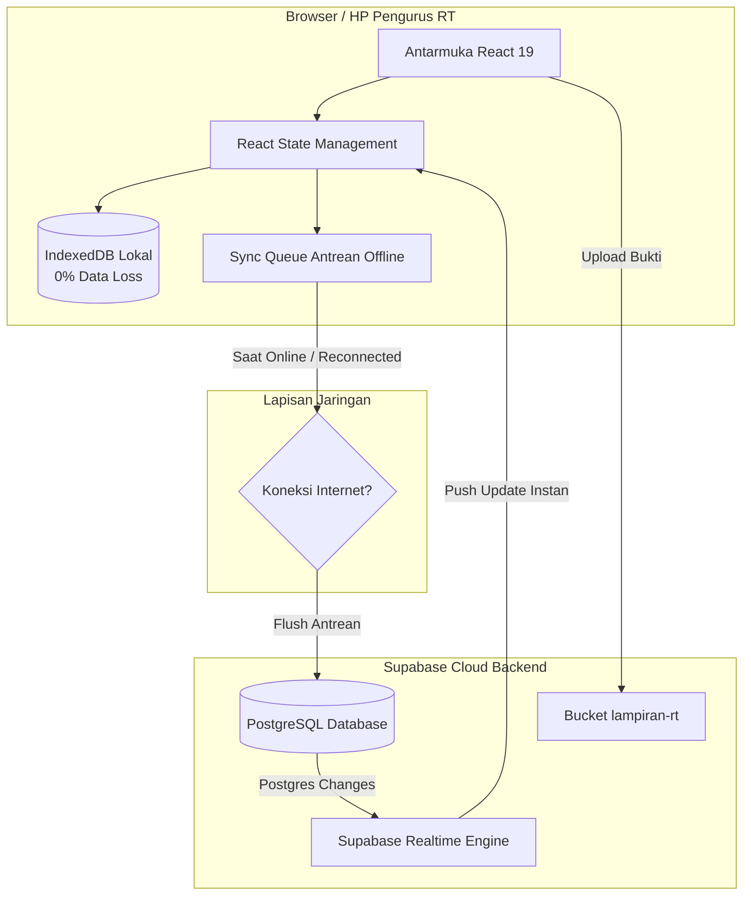

<div align="center">

# 🏛️ Sistem Administrasi & Manajemen RT Digital (RT 02 / RW 04 Gasem Raya)
### *Modern, Resilient, Privacy-First Grassroots Governance System*

[](https://react.dev/)
[](https://www.typescriptlang.org/)
[](https://vitejs.dev/)
[](https://supabase.com/)
[](https://ai.google.dev/)
[](https://web.dev/progressive-web-apps/)
[](#-kepatuhan-privasi-data-uu-pdp-no-27-tahun-2022)

<p align="center">
  Aplikasi manajemen kependudukan dan tata kelola rukun tetangga berbasis web progresif (PWA) yang menggabungkan ketangguhan <b>Offline-First</b>, sinkronisasi <b>Cloud Realtime</b>, otomasi kecerdasan buatan <b>Gemini AI</b>, serta perlindungan privasi data warga sesuai amanat <b>UU Pelindungan Data Pribadi (UU PDP)</b>.
</p>

---

</div>

## 💡 Filosofi & Mengapa Sistem Ini Berbeda?

Digitalisasi di tingkat akar rumput (RT/RW) seringkali menghadapi 3 tantangan klasik:
1. **Konektivitas Tidak Stabil di Lapangan**: Pengurus sering kali mencatat iuran di pos ronda atau rumah warga dengan sinyal internet minim. Aplikasi berbasis cloud murni sering mengalami *freeze* atau data gagal tersimpan.
2. **Kekhawatiran Kebocoran NIK & Data Pribadi**: Daftar warga yang memuat NIK dan nomor KK rentan disalahgunakan jika aplikasi tidak menerapkan enkripsi dan sensor tampilan publik.
3. **Birokrasi & Redaksional Surat yang Memakan Waktu**: Pembuatan surat pengantar, rekomendasi warga, serta pelaporan bulanan ke tingkat RW/Kelurahan kerap memakan waktu berulang.

Sistem ini dirancang dari bawah (*grassroots-centric*) untuk menjawab permasalahan tersebut secara tuntas melalui kombinasi arsitektur **Offline-First IndexedDB**, **Supabase Cloud Synchronization**, dan **Google Gemini Generative AI**.

---

## 🌟 Pilar Fitur Unggulan

### 1. 👥 Buku Induk Kependudukan & Kartu Keluarga Terhubung
- **Buku Induk Digital**: Pencatatan lengkap data demografi warga (nama, NIK, TTL, agama, status perkawinan, pekerjaan, golongan darah, pendidikan, hingga kontak darurat).
- **Pengelompokan Kartu Keluarga (KK)**: Hubungan antar anggota keluarga dalam 1 nomor KK terhubung secara otomatis dengan penandaan dinamis Kepala Keluarga, Istri, dan Anak.
- **Cetak Formulir Resmi KK**: Format lembar resmi siap cetak (*print-ready*) untuk kebutuhan verifikasi domisili.

### 2. 💰 Buku Kas & Transparansi Keuangan Realtime
- **Pencatatan Arus Kas**: Manajemen kategori pemasukan (iuran bulanan, dana sosial, donasi, sampah) dan pengeluaran (lampu jalan, kebersihan, konsumsi kerja bakti, santunan duka).
- **Lampiran Digital Terkompresi**: Bukti kuitansi/nota belanja dikompresi otomatis di sisi browser sebelum diunggah ke storage cloud untuk menghemat kuota dan memori penyimpanan.
- **Laporan Transparansi**: Rekapitulasi saldo, pemasukan, dan pengeluaran per bulan atau tahunan yang dapat diunduh dalam format CSV maupun dicetak langsung.

### 3. 🔄 Dinamika Mutasi & Rekapitulasi Otomatis
- Pencatatan 4 peristiwa kependudukan: **Lahir**, **Meninggal**, **Pindah Masuk**, dan **Pindah Keluar**.
- Peristiwa kematian atau kepindahan otomatis memperbarui status kehidupan warga pada database utama.
- Menghasilkan **Laporan Rekapitulasi Penduduk Bulanan** resmi yang siap ditandatangani oleh Ketua RT dan Ketua RW untuk diserahkan ke Kelurahan.

### 4. 🤖 Asisten Cerdas AI (Google Gemini)
- Konsultasi administrasi warga berbasis kecerdasan buatan.
- Otomasi pembuatan draf surat pengantar (pembuatan KTP, SKCK, surat keterangan domisili, surat keterangan tidak mampu).
- Analisis demografi cepat (misal: menghitung proporsi lansia untuk program posyandu lansia).

### 5. 🛡️ Kepatuhan Privasi Data (UU PDP No. 27 Tahun 2022)
- **Data Minimization & Dynamic Masking**: NIK, Nomor KK, dan Nomor Telepon disensor secara otomatis (`3374**********02`) pada tampilan publik.
- **Role-Based Visibility**: Hanya akun Pengurus/Admin terotentikasi yang berhak melihat data identitas lengkap secara utuh (*unmasked*).

### 6. 🎨 Pelestarian Budaya & Nuansa Lokal
- Kustomisasi visual terintegrasi dengan berbagai preset motif batik nusantara (**Batik Soga Klasik**, **Mega Mendung Cirebon**, **Parang Rusak**, dan **Kawung**) dipadukan dengan aksen modern dan konfigurasi logo RT.

### 7. 📱 Dukungan PWA & Instalasi Android (WebAPK)
- Dapat diinstal langsung ke layar utama (*Add to Home Screen*) pada smartphone Android maupun iOS layaknya aplikasi native tanpa memerlukan Google Play Store.

---

## 🏗️ Arsitektur Sistem & Alur Sinkronisasi Data

Sistem menerapkan paradigma **Dual-Tier Resilient Architecture**:



### Mekanisme *Zero Data Loss*:
1. **Penyimpanan Lokal Pertama**: Setiap kali ada penambahan atau perubahan data warga/kas, data seketika disimpan ke basis data IndexedDB lokal browser. Refresh halaman (F5) tidak akan menghilangkan data.
2. **Antrean Mutasi (*Offline Queue*)**: Jika perangkat sedang tidak tersambung ke internet, perubahan dimasukkan ke dalam `sync_queue`.
3. **Flushing & Rekonsiliasi**: Begitu koneksi internet pulih, antrean dikirimkan secara berurutan ke Supabase Cloud sebelum data terbaru ditarik, menjamin data lokal tidak tertimpa.
4. **Sinkronisasi Realtime**: Menggunakan WebSocket `supabase.channel` sehingga input yang dilakukan Bendahara di laptop langsung terlihat di HP Pak RT secara *live*.

---

## 🔐 Matriks Hak Akses & Peran (RBAC)

| Modul / Tindakan | Publik / Warga Tamu | Pengurus RT / Admin |
|---|:---:|:---:|
| **Buku Induk Warga** (Melihat Daftar) | ✅ (NIK & KK Disensor) | ✅ (Akses Penuh / Unmasked) |
| **Tambah / Edit / Hapus Warga** | ❌ (Tombol Tersembunyi) | ✅ |
| **Buku Kas Keuangan** (Lihat Saldo & Transparansi) | ✅ | ✅ |
| **Catat & Hapus Transaksi Kas** | ❌ (Tombol Tersembunyi) | ✅ |
| **Arsip Dokumen RT** (Unduh & Baca AD/ART) | ✅ | ✅ |
| **Unggah & Hapus Dokumen RT** | ❌ (Tombol Tersembunyi) | ✅ |
| **Pencatatan Mutasi Kependudukan** | ❌ | ✅ |
| **Pengaturan Wilayah & Tema RT** | ❌ | ✅ |
| **Asisten AI RT (Gemini)** | ✅ (Konsultasi Warga) | ✅ (Draf Surat & Analisis) |

---

## 📂 Struktur Direktori

```text
rtgasem/
├── public/                     # Aset statis, ikon PWA & manifest
├── src/
│   ├── components/             # Komponen antarmuka modular
│   │   ├── DaftarWarga.tsx     # Buku induk kependudukan & pencarian
│   │   ├── DaftarKeluarga.tsx  # Pengelompokan Kartu Keluarga (KK)
│   │   ├── BukuKasKeuangan.tsx # Pembukuan kas, nota, dan ekspor CSV
│   │   ├── ArsipDokumen.tsx    # Manajemen arsip berkas & AD/ART
│   │   ├── MutasiManager.tsx   # Pencatatan lahir, mati, dan pindah
│   │   ├── LaporanBulanan.tsx  # Format rekapitulasi kependudukan resmi
│   │   ├── AsistenAiModal.tsx  # Integrasi Google Gemini AI
│   │   ├── GoogleDriveManager.tsx # Manajemen workspace Google Drive
│   │   └── ...
│   ├── services/               # Lapisan logika layanan & API
│   │   ├── supabaseClient.ts   # Klien Supabase Cloud
│   │   ├── supabaseAuth.ts     # Otentikasi aman pengurus
│   │   ├── supabaseService.ts  # Sinkronisasi & rekonsiliasi data cloud
│   │   ├── offlineStorage.ts   # Penyimpanan tangguh IndexedDB & Sync Queue
│   │   ├── geminiService.ts    # Service integrasi model Gemini
│   │   └── googleDriveAuth.ts  # Otorisasi OAuth Google Drive (drive.file)
│   ├── utils/                  # Algoritma perhitungan, enkripsi & mask NIK
│   ├── types.ts                # Kontrak tipe data TypeScript
│   ├── App.tsx                 # Root component & orkestrasi sinkronisasi
│   └── main.tsx                # Entry point aplikasi & registrasi PWA
├── supabase/
│   ├── schema.sql              # Skema DDL tabel & relasi database
│   └── fix_rls_permissions.sql # Kebijakan keamanan RLS (Row Level Security)
├── .env.example                # Template konfigurasi environment
├── .gitignore                  # Aturan proteksi kredensial rahasia
└── vite.config.ts              # Konfigurasi bundler Vite & modul PWA
```

---

## 🚀 Panduan Instalasi & Menjalankan Lokal

### 1. Prasyarat Sistem
- **Node.js**: Versi `>= 18.0.0`
- **NPM** atau **Bun**

### 2. Kloning Repositori
```bash
git clone https://github.com/erinurshofa/manajemenrt.git
cd manajemenrt
```

### 3. Instalasi Dependensi
```bash
npm install
```

### 4. Konfigurasi Environment
Salin berkas template `.env.example` menjadi `.env`:
```bash
cp .env.example .env
```

Buka berkas `.env` dan lengkapi variabel berikut:
```env
# Supabase Cloud Configuration
VITE_SUPABASE_URL="https://your-project-id.supabase.co"
VITE_SUPABASE_ANON_KEY="your-anon-key"

# Google Gemini AI
GEMINI_API_KEY="your-gemini-api-key"
VITE_GEMINI_API_KEY="your-gemini-api-key"

# Google Drive (Opsional)
VITE_GOOGLE_CLIENT_ID=""
VITE_GOOGLE_API_KEY=""
```

### 5. Menyiapkan Database Supabase (Opsional jika menggunakan Cloud)
1. Buat proyek baru di [Supabase Dashboard](https://supabase.com/).
2. Buka menu **SQL Editor** -> **New Query**.
3. Buka berkas [supabase/schema.sql](supabase/schema.sql) dan jalankan seluruh query untuk membuat tabel dan indeks.
4. Buka berkas [supabase/fix_rls_permissions.sql](supabase/fix_rls_permissions.sql) dan jalankan untuk mengaktifkan kebijakan keamanan RLS.
5. Buat Storage Bucket bernama `lampiran-rt` dengan visibilitas publik untuk berkas bukti kas.

### 6. Menjalankan Server Development
```bash
npm run dev
```
Akses aplikasi melalui peramban di: `http://localhost:3000`.

### 7. Membangun Bundle Produksi
```bash
npm run build
```

---

## 📜 Kebijakan Lisensi & Kontribusi

Sistem ini dikembangkan secara terbuka untuk memajukan digitalisasi tata kelola lingkungan warga di Indonesia. Kontribusi berupa perbaikan *bug*, usulan modul baru, maupun penyempurnaan fitur sangat kami nantikan melalui *Pull Request* atau *Issue* di repositori ini.

---

<div align="center">
  <b>Dikelola dengan bangga oleh Pengurus RT 02 / RW 04 Gasem Raya</b><br>
  <i>Kelurahan Tlogosari Wetan, Kecamatan Pedurungan, Kota Semarang</i>
</div>
